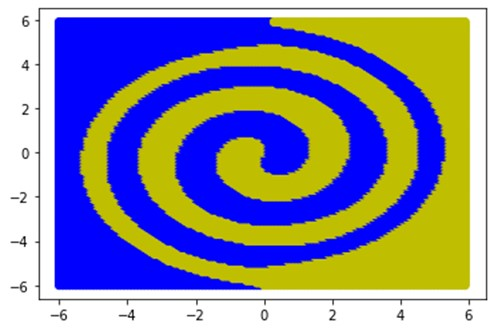

# 2_Spiral_Task
Machine Learning - Two Spiral Task

The two-spiral problem is a classification task that consists of deciding in which of two interlocking spiral-shaped regions a given coordinate lies. The interlocking spiral shapes are chosen for this problem because they are not linearly separable.

The two sprial task was solved using an artifical neural network and state vector machine. 

## Best Result
SVM: 
    C = 0.8
    Kernel =  ‘rbf’
    Gamma = 0.75

